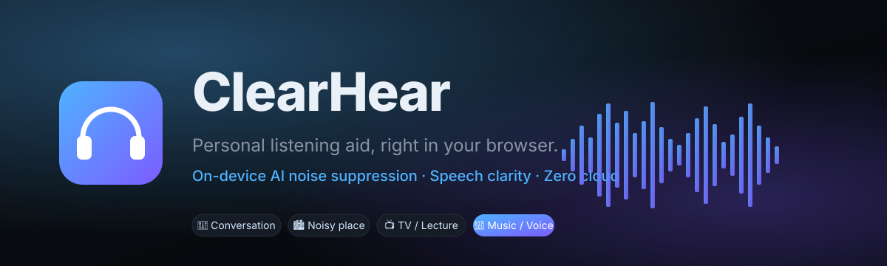
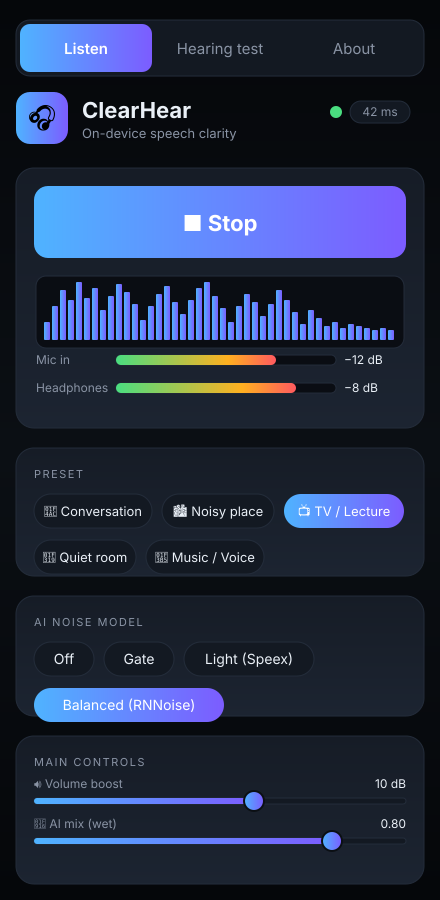
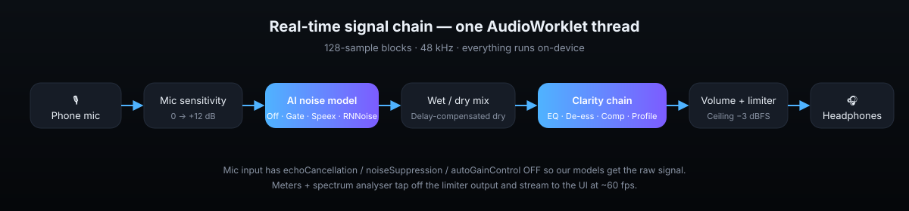

<div align="center">



<h1>ClearHear <sub><em>web</em></sub></h1>

**A personal listening aid that runs entirely in your browser.**
Turn any phone into an AI-powered hearing assistant — mic in, cleaned speech out to your headphones.
Nothing leaves the device.

<p>
  <a href="#-quick-start"></a>
  
  
  
  
  
</p>

<sub>🎧 <em>Wear headphones. Start at low volume. This is an assistive listening aid, not a medical device.</em></sub>

</div>

---

## ✨ Why ClearHear?

Hearing conversations in noisy places — markets, offices, restaurants, in front of the TV — is hard, and clinical hearing aids are expensive. **ClearHear** turns the phone already in your pocket into a personal listening aid: the mic picks up the person you want to hear, a neural noise suppressor cleans it, a speech-clarity chain sharpens it for your ear, and the result plays into your headphones — all with under **60 ms** of end-to-end delay.

Because everything runs in the browser via **Web Audio + AudioWorklets + WASM**, no audio ever leaves the device. No accounts. No cloud. No microphone data sent anywhere.

---

## 📸 Screenshots

<table>
  <tr>
    <td align="center"><br/><sub><b>Listen</b> — Start button, live spectrum, meters, presets, sliders</sub></td>
    <td align="center" valign="middle">
      <ul align="left">
        <li>Big one-tap <b>Start / Stop</b></li>
        <li>Live spectrum + input / output meters</li>
        <li>5 presets · 4 AI models · 9 clarity sliders</li>
        <li>Delay readout <em>(before Bluetooth)</em></li>
        <li>Dark, high-contrast, 48 px touch targets</li>
      </ul>
    </td>
  </tr>
</table>

---

## 🧠 How it works

<div align="center">
  
</div>

The audio pipeline runs on a **single AudioWorklet render thread** at 48 kHz in 128-sample blocks:

1. **Raw mic capture** with the browser's echo cancellation, noise suppression and AGC all **disabled** so our models see the original signal.
2. **Mic sensitivity** trim (0 → +12 dB).
3. **AI noise suppression** — one of four models (see below), swappable live with a 50 ms crossfade.
4. **Wet / dry mix** — the dry path is delayed to match the model's group delay so blends don't sound hollow.
5. **Speech clarity worklet** — HPF · warmth · presence · formant shelf · air · 6-band personal EQ · dynamic de-esser · compressor · makeup · stereo balance.
6. **Brick-wall limiter** at −3 dBFS to protect your ears.

---

## 🤖 Noise suppression models

| Model | Type | Sample rate | Added delay | CPU | Best for |
|---|---|---|---|---|---|
| **Off** | passthrough | any | 0 ms | none | Quiet rooms |
| **Gate** | classic noise gate | any | ~3 ms | tiny | Steady low background |
| **Speex** | classic DSP preprocess | any | ~15 ms | very low | Fans, AC, hum |
| **RNNoise** | 3-layer GRU network | 48 kHz | ~10 ms | low | Crowds, traffic — default |
| **GTCRN** *(planned)* | CNN-RNN | 16 kHz | ~16 ms | low-med | Better voice than RNNoise |
| **DeepFilterNet 3** *(planned)* | deep filtering | 48 kHz | ~30 ms | med-high | Flagship phones |

Models load lazily. On first run a benchmark picks the strongest one that fits the device.

---

## 🎚 Clarity chain — every knob

| Band | Frequency | Role |
|---|---|---|
| High-pass | 150 Hz | Kill rumble & handling noise |
| Low-pass | 7.5 kHz | Tame anti-alias hiss |
| Warmth | 800 Hz peak | Add body to thin voices |
| Clarity | 2.5 kHz peak | Consonant intelligibility |
| Formant | 3.5 kHz shelf | Vowel definition |
| Air | 10 kHz shelf | Presence & sparkle |
| **De-esser** | 6.5 kHz detect → 6 kHz duck | Kills harsh S / T sibilance |
| Compressor | −28 dB, 3:1, 5 ms attack | Even loudness |
| Profile EQ | 250 / 500 / 1k / 2k / 4k / 6k | Personalised per ear from the hearing test |
| Limiter | −3 dBFS, 20:1 | Hard safety ceiling |

---

## 👂 Personal hearing profile

A 3–4 minute per-ear tone test measures your threshold at 250 · 500 · 1000 · 2000 · 4000 · 6000 Hz and applies the **half-gain rule** — half of each measured deficit — to build a per-band EQ curve. Profiles are stored locally via IndexedDB, one per headphone.

> **Not a medical audiogram.** Phone + headphones aren't calibrated equipment. The result is a *relative* profile: "this pitch needs 15 dB more than your best one."

---

## 🚀 Quick start

```bash
git clone https://github.com/37OMKAR/listenwell.git
cd listenwell
npm install
npm run dev
```

Open the printed URL. **HTTPS is required for mic access on real phones** — either deploy the built site, use a tunnel (`cloudflared tunnel --url http://localhost:5173`), or run against `localhost`.

### Build for production

```bash
npm run build   # emits dist/
npm run preview # local preview of dist/
```

### Tests

```bash
npm test        # Vitest unit tests: biquad, compressor, limiter, hearing fit
```

---

## 🏗 Project layout

```
clearhear-web/
├─ src/
│  ├─ main.tsx                   # Preact entry
│  ├─ ui/
│  │  ├─ App.tsx                 # tabs: Listen / Hearing test / About
│  │  ├─ ListenScreen.tsx        # hero, meters, spectrum, presets, sliders
│  │  ├─ HearingTest.tsx         # per-ear threshold search
│  │  └─ components/             # Slider · Meter · Spectrum
│  ├─ audio/
│  │  ├─ engine.ts               # AudioContext graph + live model switch
│  │  ├─ devices.ts              # mic + output picker (Bluetooth detection)
│  │  ├─ params.ts               # typed engine params + presets
│  │  └─ worklets/
│  │     ├─ clarity.worklet.ts   # EQ · de-esser · comp · limiter · balance
│  │     └─ meter.worklet.ts     # peak meter tap
│  ├─ models/loaders.ts          # noise-suppressor loader
│  ├─ dsp/                       # pure-TS biquad · compressor · limiter (unit-tested)
│  ├─ hearing/                   # tone generator + half-gain fitting
│  └─ storage/profiles.ts        # IndexedDB via idb-keyval
├─ tests/                        # Vitest
├─ public/_headers               # COOP/COEP for WASM threads, wasm caching
└─ vite.config.ts                # PWA plugin + dev headers
```

---

## 🧰 Tech stack

- **[Vite 5](https://vitejs.dev)** + **TypeScript** — dev server, WASM/worklet asset handling
- **[Preact](https://preactjs.com)** — ~10 KB UI runtime for fast phones
- **Web Audio API + AudioWorklet** — 128-sample real-time render thread
- **[@sapphi-red/web-noise-suppressor](https://github.com/sapphi-red/web-noise-suppressor)** — Speex, RNNoise, noise-gate WASM worklets
- **[vite-plugin-pwa](https://vite-pwa-org.netlify.app/)** + Workbox — install to home screen, offline caching of models
- **[idb-keyval](https://github.com/jakearchibald/idb-keyval)** — local hearing profiles
- **Vitest** — headless DSP tests

---

## 🗺 Roadmap

- [x] Sprint 1 — Vite + Preact + clarity worklet + Listen UI
- [x] Sprint 2 — Speex / RNNoise / Gate wired up, live model crossfade, spectrum visualizer
- [ ] Sprint 3 — GTCRN + DeepFilterNet 3, offline benchmark & live watchdog
- [ ] Sprint 4 — Hearing test → per-ear profile EQ in worklet, fine-tune screen
- [ ] Sprint 5 — Device matrix (budget / mid / flagship Android, iOS Safari), Hindi + Marathi strings, TalkBack / VoiceOver pass
- [ ] Post-launch — On-device Whisper captions (WebGPU), Android app port

See [`implemton.md`](../implemton.md) for the full plan.

---

## 🔐 Privacy

- All audio is processed **on the device**. Nothing is uploaded.
- No analytics on audio streams.
- Optional anonymous benchmark stats (model, RTF, phone model string) — opt-in only, off by default.

## ⚠️ Safety

- Hard limiter at −3 dBFS is always on and cannot be disabled.
- Personal EQ gains are capped at +25 dB per band.
- First-run cards remind you to start at low volume.
- If one ear is much worse than the other, the app suggests seeing an audiologist.

## 📜 License

MIT. See [LICENSE](LICENSE).

---

<div align="center">
  <sub>Built with 🎧 &nbsp;•&nbsp; <a href="https://github.com/37OMKAR/listenwell/issues">Feedback & issues</a></sub>
</div>
